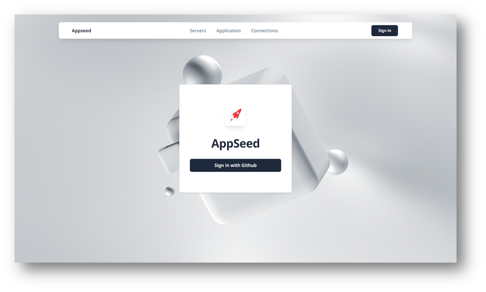
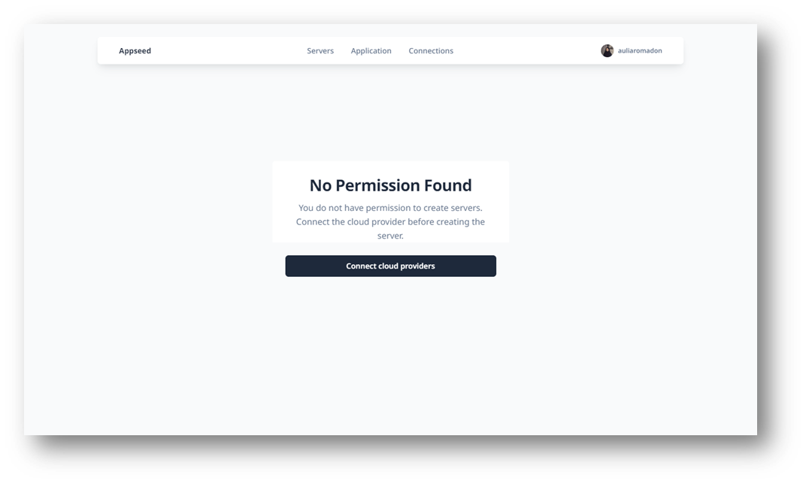

# Getting Started

In this documentation, we will guide you through the process of registering on Deploypro, enabling you to get started with deploying and managing your applications on this powerful platform.

## Sign in with GitHub

- Step 1: Accessing the Deploypro Website

    To begin the registration process, open your web browser and navigate to the Deploypro website at https://www.deploypro.dev/. Once there, click on the "Sign in" button located in the top right corner or in the middle of the page.

    

- Step 2: Sign in to Deploypro with GitHub Account

    Right now, we support login with GitHub. So, you need to connect Deploypro with your GitHub Account and enable the authorization request.

    

- Step 3: **Welcome to Deploypro**

    After allowing the authorization to your GitHub Account, you have completed the registration on Deploypro.

    

    The picture above is how it looks for new user registered. No permission found because you have not connect any cloud provider. Let's continue the tutorial to the next phase!

 

## Resources

- 👉 [Deploy Projects](https://deploypro.dev/) using your own cloud provider
- 👉 Get [Deployment Support](https://deploypro.dev/support/) from `experts` 
