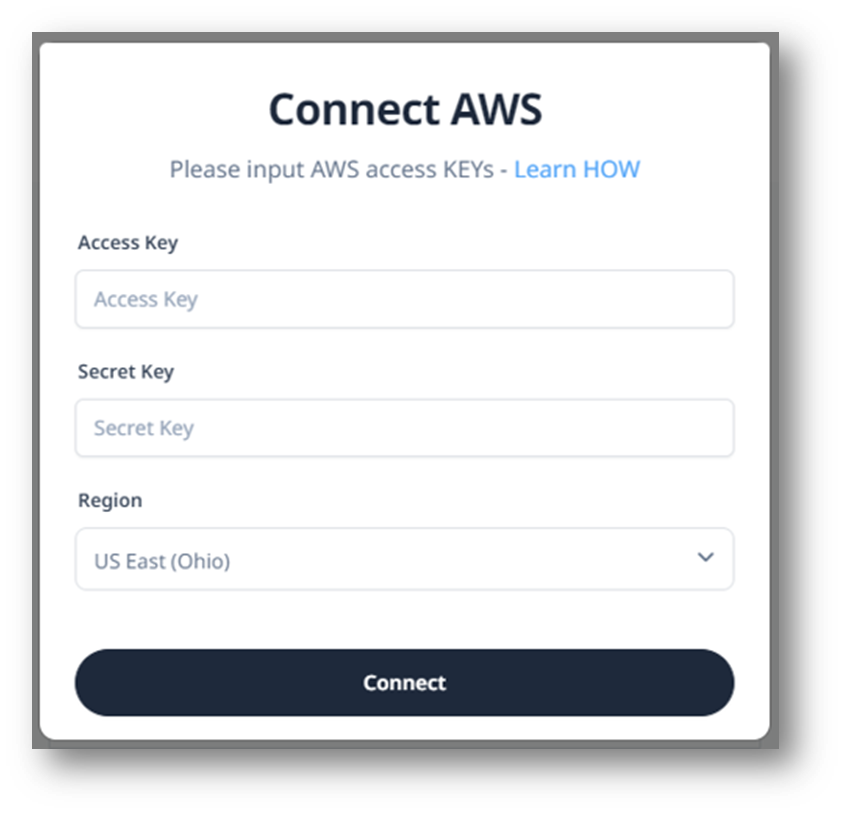
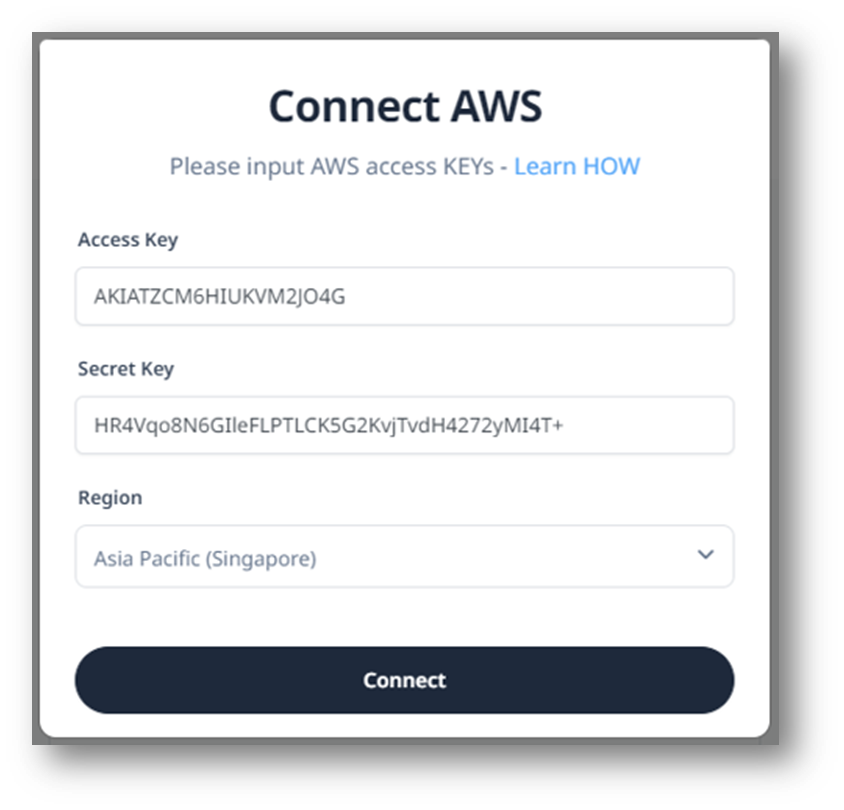

# Connect to AWS on Deploypro

You need to log in to your Deploypro Account before connecting to any cloud provider. Log in to your account. If you don’t have one yet, try to [register](http://localhost:3000/app-platform-do/intro).

## Overview
- Connect to AWS Account on the Connections Menu
- Deploy a Static App
    - Create Server
    - Create App

## Connection

1. In the Connection Menu, click `Connect` in the AWS section.
    

2. Copy and paste your access key and secrete key from the *.csv file you just downloaded on the form provided.
    

    Don't forget to select the nearest server to your place to make the performance work better!

3. Click “Connect” and wait until the process is finished.
    

4. Upon success, the view will look like the picture below.
    

## Create a Server
@todo

## Create a Static App on Deploypro
@todo

 

## Resources

- 👉 [Deploy Projects](https://deploypro.dev/) using your own cloud provider
- 👉 Get [Deployment Support](https://deploypro.dev/support/) from `experts` 